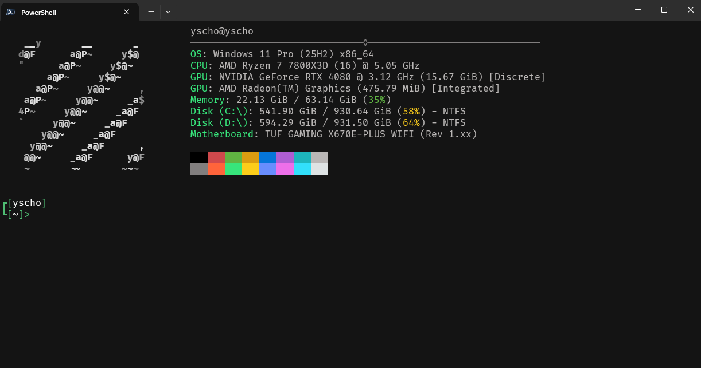

# Terminal Setup


My personal Windows Terminal setup, a collection of config files that give you a clean, themed PowerShell experience with a system info splash screen. Includes a translucent acrylic color theme, a customized oh-my-posh prompt, and a fastfetch greeting with ANSI art.

## What's Included

| file | description |
| ---- | ----------- |
| `bin/settings.json` | Windows Terminal config - Dimidium color scheme, acrylic transparency, FiraCode Nerd Font |
| `bin/Microsoft.PowerShell_profile.ps1` | PowerShell profile - oh-my-posh prompt + fastfetch on startup |
| `bin/config.jsonc` | Fastfetch config - system info layout with colored sections |
| `bin/logo.ans` | ANSI art logo displayed by fastfetch |

## Prerequisites

Install the following using `winget`:

| dependency | install command |
| ---------- | --------------- |
| oh-my-posh | `winget install --id=JanDeDobbeleer.OhMyPosh -e` |
| fastfetch | `winget install --id=Fastfetch-cli.Fastfetch -e` |
| chafa | `winget install --id=hpjansson.Chafa -e` |

You also need to install [FiraCode Nerd Font](https://github.com/ryanoasis/nerd-fonts/releases/download/v3.4.0/FiraCode.zip) - download the zip, extract it, select all `.ttf` files, right-click, and choose **Install**.

> [!Note]
> FiraCode Nerd Font is my personal preference. Any [Nerd Font](https://www.nerdfonts.com/) will work - just update the font name in `bin/settings.json` if you choose a different one.

## Setup

### Step 1 - Terminal Theme

1. Open **Windows Terminal** and press `Ctrl + ,` to open Settings.
2. In the bottom-left corner, click **Open JSON file**.
3. Replace the entire contents of that file with the contents of `bin/settings.json` from this repo.
4. Save and close the file. Your terminal will reload with the new theme automatically.

This sets up the **Dimidium** color scheme, 75% transparency with acrylic blur, and **FiraCode Nerd Font Mono**.

### Step 2 - PowerShell Profile

1. Open PowerShell in Windows Terminal and run:

```powershell
notepad $PROFILE
```

> [!Note]
> If you get an error, the profile file doesn't exist yet. Create it first with:
> `New-Item -Path $PROFILE -Type File -Force`
> Then run the `notepad $PROFILE` command again.

2. Replace the contents of the file with the contents of `bin/Microsoft.PowerShell_profile.ps1` from this repo.
3. Save, close notepad, and restart your terminal.

This configures oh-my-posh with the **clean-detailed** theme and runs fastfetch every time you open a new shell.

### Step 3 - Fastfetch Config

1. Create the fastfetch config directory and file:

```powershell
New-Item -Path "$($env:APPDATA)\fastfetch" -Type Directory
New-Item -Path "$($env:APPDATA)\fastfetch\config.jsonc" -Type File
```

2. Open the config file:

```powershell
notepad "$($env:APPDATA)\fastfetch\config.jsonc"
```

3. Paste the contents of `bin/config.jsonc` from this repo into that file. Save and close.

4. Copy `bin/logo.ans` from this repo into your fastfetch folder:

```powershell
explorer "$($env:APPDATA)\fastfetch"
```

Drop the `logo.ans` file into the folder that opens. This is the ANSI art logo displayed next to your system info.

### Step 4 - Custom Logo (Optional)

If you want to use your own image instead of the included `logo.ans`:

1. Place your image as a `.png` file in the fastfetch config folder:

```powershell
explorer "$($env:APPDATA)\fastfetch"
```

2. Convert it to ANSI art using `chafa`:

```powershell
chafa -s 30x30 --symbols ascii --color-space din99d "$($env:APPDATA)\fastfetch\logo.png" > "$($env:APPDATA)\fastfetch\logo.ans"
```

> [!Note]
> Adjust the `30x30` size to fit your preference. Larger values create more detailed but bigger art.
